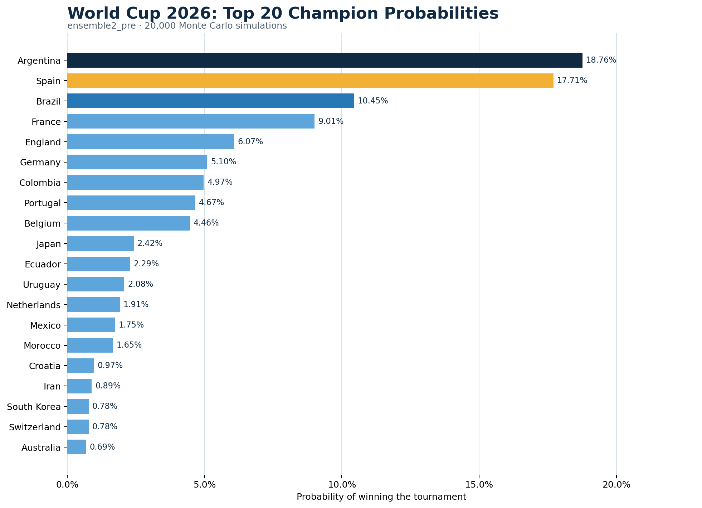
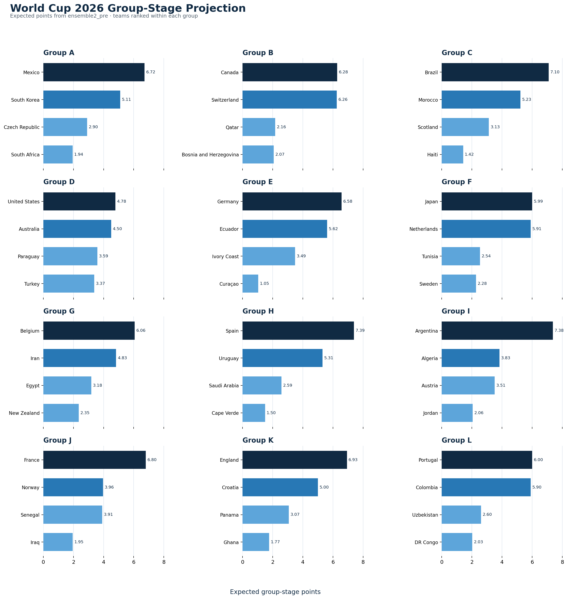

# World Cup 2026 Prediction Pipeline

This project trains match-level football models on the **International Football Results from 1872 to 2026** dataset and runs Monte Carlo simulations to estimate outcomes for the 2026 FIFA World Cup.


### Final champion probabilities



### Group-stage projection

The projection below ranks every team within its group by expected points across the simulations.




## Quick start

```powershell
python main.py --model ensemble --mode pre_tournament --simulations 20000 --output-dir outputs/ensemble_pre
```

Available models:

- `elo`: Elo rating baseline.
- `dixon-coles`: Poisson goal model with the Dixon-Coles low-score correction.
- `boosted`: uses XGBoost, LightGBM, or CatBoost when available, with a fallback to scikit-learn's `HistGradientBoosting`.
- `xgboost`: forces the standalone XGBoost win-draw-loss model.
- `catboost`: forces the standalone CatBoost win-draw-loss model.
- `bayesian`: empirical-Bayes Poisson model with shrinkage for teams with limited data.
- `ensemble`: calibrated ensemble that automatically includes LightGBM, XGBoost, and CatBoost when those packages are available.

## Data modes

- `pre_tournament`: uses a default cutoff of `2026-06-10`. Any World Cup 2026 results already present in the dataset are excluded to prevent data leakage.
- `live`: uses the latest scored World Cup 2026 match in the dataset as the cutoff and includes known results when simulating the remaining tournament.

Live example:

```powershell
python main.py --model ensemble --mode live --simulations 20000 --output-dir outputs/ensemble_live
```

XGBoost with CUDA, when the environment has a compatible GPU and CUDA installation:

```powershell
python main.py --model xgboost --mode pre_tournament --simulations 20000 --xgboost-device cuda --output-dir outputs/xgboost_cuda_pre
```

Monte Carlo progress is displayed with `tqdm` when the package is available. Add `--no-progress` to disable the progress bar.

## Ensemble2 pre-tournament results

The `outputs/ensemble2_pre` run used:

- 20,000 Monte Carlo simulations.
- 49,405 historical training matches.
- A leakage-safe training cutoff of June 10, 2026.
- Six calibrated components: Elo, Dixon-Coles, Bayesian Poisson, LightGBM, XGBoost, and CatBoost.

Argentina has the highest estimated championship probability at **18.76%**, followed by Spain at **17.71%** and Brazil at **10.45%**.

Regenerate both figures from the result CSV files with:

```powershell
python -B scripts/plot_readme_results.py
```

## Outputs

Each run writes:

- `champion_probabilities.csv`: probability of winning the tournament.
- `stage_probabilities.csv`: probability of reaching the Round of 32, Round of 16, quarterfinals, semifinals, final, and winning the tournament.
- `group_probabilities.csv`: probability of finishing first through fourth in each group.
- `group_projection.csv`: expected points, goals for, goals against, and goal difference.
- `match_predictions.csv`: outcome probabilities for each group-stage fixture.
- `metadata.json`: cutoff details, training sample count, runtime, model backends, ensemble weights, and validation log loss.

The Round of 32 follows the official FIFA match slots. Advancing third-place teams are assigned with a valid backtracking heuristic instead of hard-coding all 495 Annex C combinations.
